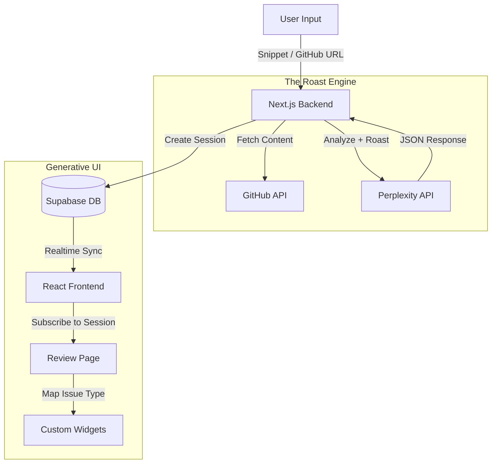

# 🔥 Code Critic: The UI Strikes Back

> **"Pull requests are boring. Code reviews are tedious. What if your UI fought back against bad code with personality?"**

[](https://youtu.be/YOUR_ID)  
**Live Demo:** [code-critic.vercel.app](https://code-critic.vercel.app)

---

## 🏆 Tambo Hackathon 2026: "The UI Strikes Back"

**Code Critic** is a "Roast-as-a-Service" platform that uses **Generative UI** to brutally (or gently) critique your code.

Instead of a boring list of lint errors, the interface **literally explodes** with custom widgets based on what's wrong with your code.

**Built with:**

- 🤖 **Tambo AI** (The Critic)
- 🧠 **Perplexity API** (The Brain)
- 🎨 **Generative UI** (The Visuals)
- ⚡ **Supabase Realtime** (Multiplayer Roasting)

---

## 🎯 What It Does

1.  **Choose Your Weapon:**
    - **Code Snippet:** Paste any code (JS, Python, Rust, etc.).
    - **GitHub File:** Paste a URL to a file.
    - **GitHub PR:** Paste a Pull Request URL to analyze the **entire changeset** (The Killer Feature).
2.  **Select Roast Level:**
    - 🥺 **Gentle:** Constructive feedback.
    - 😐 **Medium:** Witty sarcasm (Default).
    - 🔥 **Savage:** Emotional damage.
3.  **Watch the Magic:**
    - Redirects to a unique **Session URL** (`/review/[id]`).
    - Realtime updates show the analysis progress.
4.  **Generative UI Explodes:**
    - 💣 **Security Risk?** A glowing red "Security Bomb" appears.
    - 🍝 **Bad Logic?** The "Spaghetti Meter" goes off the charts.

---

## 🌶️ What is a "Roast"?

Think of a "roast" from Roast My Code as a candid, no-nonsense evaluation of your code. Our AI provides straightforward insights about your project's design, structure, maintainability, and efficiency, along with actionable advice to improve and stand out.

- **Straight Talk:** Get the real scoop on your code. Our AI cuts through the noise with honest, direct insights.
- **Deep Dive:** We check out every part of your code, from the style and patterns to how well receiving feedback, making sure you know exactly what's up.
- **Clear Next Steps:** You'll receive specific tips on what to do next. No fluff, just clear-cut advice to make your code better.
- **Fresh Ideas:** Our Roast might reveal things you hadn't thought of, leading to cool new refactors that could outshine your competitors.
- **Saves Time and Money:** Skip the wait and the expense of hiring a senior dev. Our Roast is quick and won't bust your budget while giving you the lowdown on how to level up your code.

> With a Roast, you're not just being told what's wrong - you're getting an action plan to make your codebase stand out, be developer-friendly, and win on the web.

### 🔄 Optimal Results

To achieve optimal results, we recommend roasting each PR at least twice:

1.  **Initial Roast:** Identifies key issues and provides recommendations.
2.  **Follow-up Roast:** Ensures implemented changes are effective and identifies additional refinements.
3.  **Polish Roast:** Optionally, a third roast can offer extra polish after major updates, ensuring every aspect is perfectly optimized.

---

## 🌟 Key Features (The "Strikes Back" Tech)

### 1. 🐙 GitHub PR Analysis

Paste a PR link, and Code Critic fetches the diffs, analyzes the changes, and tells you if it's safe to merge. It uses the `GITHUB_TOKEN` to access the API without hitting rate limits.

### 2. 🔗 Shareable Roast Sessions

Every review gets a unique, permanent URL. Send the link to your coworker to roast their PR properly.

### 3. 💣 Generative Widgets

The UI isn't static. It _reacts_ to your code's specific problems.

| Issue Type          | Generated Widget    | Description                                          |
| :------------------ | :------------------ | :--------------------------------------------------- |
| **Critical Vuln**   | `SecurityBomb`      | An animated red bomb that pulses based on severity.  |
| **Complexity**      | `SpaghettiMeter`    | A specialized gauge that measures "Mama Mia" levels. |
| **O(n²) Loop**      | `PerformanceTurtle` | An animated turtle racing a blur (rabbit).           |
| **Everything Else** | `GenericRoast`      | A dynamic card with custom emojis and roast text.    |

### 4. 🧠 The Roast Engine

Powered by **Perplexity `sonar-pro`**, Code Critic doesn't just find bugs—it understands _context_.

> **Code:** `const password = "admin123";`
> **Roast:** "Congratulations! You've just built a security system that can be hacked by a golden retriever."

### 5. ☀️ Light & Dark Mode

Because developers debate themes as much as code styles.

---

## 🏗️ Architecture



**Stack Refined:**

- **Frontend:** Next.js 16, Framer Motion, Lucide Icons, Tailwind CSS.
- **Backend:** Next.js API Routes, Perplexity API, GitHub API.
- **Database:** Supabase (Postgres + Realtime).

---

## 🚀 Quick Start

### Prerequisites

- Node.js 18+
- Supabase Project
- Perplexity API Key
- GitHub Personal Access Token (for PR analysis)

### 1. Clone & Install

```bash
git clone https://github.com/tosif121/code-critic.git
cd code-critic
npm install
```

### 2. Setup Database

Run the content of `supabase/migrations/schema.sql` in your Supabase SQL Editor.
_Note: The schema handles clean installation automatically._

### 3. Configure Environment

```env
# .env.local
NEXT_PUBLIC_SUPABASE_URL=your_project_url
NEXT_PUBLIC_SUPABASE_ANON_KEY=your_anon_key
PERPLEXITY_API_KEY=your_perplexity_key
GITHUB_TOKEN=your_github_token
```

### 4. Run Locally

```bash
npm run dev
```

---

## 🟢 Demo Scenarios

### Scenario 1: The "Bob Builder" (Security Risk)

**Input:** Snippet: `db.query("SELECT * FROM users WHERE id = " + id)`
**Result:**

- **Widget:** `SecurityBomb` (Critical)
- **Roast:** "This SQL injection vulnerability is so wide open, I could drive a truck through it alongside your entire database."

### Scenario 2: The "Yolo Loop" (Performance)

**Input:** Nested loops iterating over 100k items.
**Result:**

- **Widget:** `PerformanceTurtle` (Slow)
- **Roast:** "This code is slower than a dial-up connection in 1999. O(n^2)? more like O(no)."

### Scenario 3: The "Italian Chef" (Complexity)

**Input:** A 200-line function with 15 if-else statements.
**Result:**

- **Widget:** `SpaghettiMeter` (95%)
- **Roast:** "I've seen bowls of pasta with better structure than this logic."

---

> **"Code reviews shouldn't be boring. Let the UI strike back."**
>
> Built with ❤️ (and sass) by [@tosif121](https://github.com/tosif121) for Tambo Hackathon 2026
