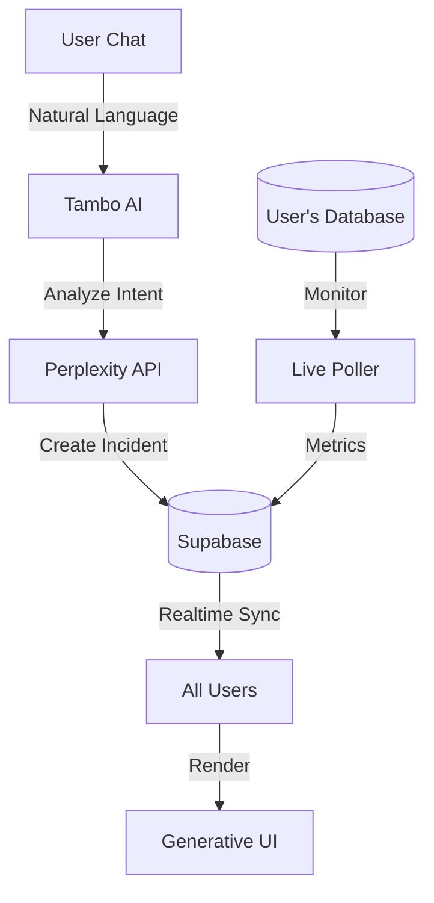

# 🚨 Data Guard: The AI Incident Commander

> **"When production is burning, don't search for dashboards. Data Guard builds them for you, in real-time."**

[](https://youtu.be/YOUR_ID)  
**Live Demo:** [dataguard.vercel.app](https://dataguard.vercel.app)

---

## 🏆 Tambo Hackathon 2026: "The UI Strikes Back"

**Data Guard** is the world's first incident management system with **Generative UI**. Instead of static dashboards, the interface adapts in real-time based on what's breaking.

**Built with:**

- 🤖 Tambo AI (natural language incident detection)
- ⚡ Supabase Realtime (multiplayer sync)
- 🎨 Generative UI (dynamic component rendering)

---

## 🎯 What Makes Data Guard Different?

| Traditional Tools           | Data Guard                            |
| --------------------------- | ------------------------------------- |
| Static dashboards           | **Generative UI** adapts per incident |
| English-only                | **Multi-language** (Hindi/Hinglish)   |
| 30-day setup (agents, SDKs) | **30-second** connection              |
| Manual triage               | **AI auto-detects** and categorizes   |
| One-size-fits-all           | **Dynamic widgets** per problem type  |

**TL;DR:** Not another monitoring tool. An AI-powered incident commander that adapts to YOU.

---

## 🌟 Key Features

### 1. ⚡ Zero-Config Database Monitoring

**No agents. No sidecars. Just credentials.**

```
1. Paste Supabase URL + API Key
2. AI scans your schema
3. Select tables to monitor
4. Start monitoring (< 30 seconds)
```


**What it monitors:**

- Failed transactions (e.g., `orders.status='failed'`)
- Error logs (e.g., `error_logs` table)
- Slow queries (response time > 2s)
- Data anomalies (sudden spikes/drops)

---

### 2. 🧠 AI-Powered Incident Detection

**Multi-language natural language processing:**

```
English: "Payment API is failing"
Hindi: "Payment service band ho gayi"
Hinglish: "Yaar checkout phat gayi hai"
```


**What happens:**

1. Tambo AI analyzes intent
2. Perplexity categorizes incident type
3. Creates incident in database
4. **Generates custom UI** based on problem

---

### 3. 🎨 Generative UI (The Magic!)

**Different problems = Different dashboards**

| Incident Type   | Generated Widgets                             |
| --------------- | --------------------------------------------- |
| Payment Failure | ErrorGraph + PaymentLogs + RollbackButton     |
| Slow Queries    | LatencyGraph + QueryAnalyzer + OptimizeButton |
| Traffic Spike   | TrafficGraph + AutoScaler + LoadBalancer      |


**Powered by `ui_config` JSONB:**

```json
{
  "widgets": [
    { "componentName": "ErrorGraph", "reason": "Spike detected" },
    { "componentName": "RollbackButton", "reason": "Recent deployment" }
  ],
  "suggestedActions": ["Rollback to v1.2.3", "Scale up instances"]
}
```

---

### 4. 🔄 Real-Time Collaboration

**Multiplayer incident response:**

- All team members see the same dashboard
- Actions sync across sessions
- Timeline updates live
- Supabase Realtime + Tambo = magic

---

### 5. 🤖 AI Post-Mortems

Auto-generated after incident resolution:

- Timeline reconstruction
- Root cause analysis
- Suggested preventions
- MTTR calculation

---

## 🏗️ Architecture



**Stack:**

- Frontend: Next.js 16, Framer Motion, Recharts
- Backend: Supabase (Postgres, Realtime, RPC)
- AI: Tambo + Perplexity API
- Real-time: Custom `useLiveMonitor` hook

---

## 🚀 Quick Start

### Prerequisites

- Node.js 18+
- [Supabase](https://supabase.com) project
- [Tambo](https://tambo.ai) API key
- [Perplexity](https://perplexity.ai) API key

### 1. Clone & Install

```bash
git clone https://github.com/tosif121/data-guard.git
cd data-guard
npm install
```

### 2. Setup Database

1. Go to Supabase SQL Editor
2. Run `supabase/migrations/schema.sql`
3. Enable Realtime for tables: `services`, `incidents`, `metrics`, `error_logs`

### 3. Configure Environment

```env
# .env.local
NEXT_PUBLIC_SUPABASE_URL=your_project_url
NEXT_PUBLIC_SUPABASE_ANON_KEY=your_anon_key
NEXT_PUBLIC_TAMBO_API_KEY=your_tambo_key
PERPLEXITY_API_KEY=your_perplexity_key
```

### 4. Run

```bash
npm run dev
# Open http://localhost:3000
```

---

## 📂 Project Structure

```
data-guard/
├── src/
│   ├── app/
│   │   ├── page.tsx              # Main Dashboard
│   │   ├── actions.ts            # Server Actions
│   │   └── api/                  # API Routes
│   ├── components/               # Generative Widgets
│   │   ├── ErrorGraph.tsx
│   │   ├── LogStream.tsx
│   │   ├── IncidentTimeline.tsx
│   │   └── ActionButton.tsx
│   ├── lib/
│   │   ├── hooks/
│   │   │   └── useLiveMonitor.ts # Custom Poller
│   │   ├── incident-analyzer.ts  # Perplexity AI
│   │   └── incident-detector.ts  # Incident Logic
├── supabase/
│   └── migrations/
│       └── schema.sql             # Database Schema
└── public/
    └── screenshots/               # Demo Images
```

---

## 🛠️ Troubleshooting

**Realtime not working?**

- Go to Supabase → Database → Replication
- Enable realtime for: `incidents`, `metrics`, `error_logs`

**Schema detection fails?**

- Verify anon key has `SELECT` permissions
- Check if tables are in `public` schema

**AI not responding?**

- Verify `PERPLEXITY_API_KEY` in `.env.local`
- Check API quota limits

---

## 📸 Screenshots

### Healthy State


### Alert Mode


### Schema Visualizer


### Multi-Language


---

## 🙏 Acknowledgments

Built for **Tambo Hackathon 2026** with:

- Tambo AI - Natural language incident detection
- Supabase - Realtime database & auth
- Perplexity - AI analysis engine
- Next.js 16 - Full-stack framework

---

## 📝 License

MIT License - Build whatever you want with this!

---

## 🔗 Links

- **Live Demo:** [dataguard.vercel.app](https://dataguard.vercel.app)
- **Demo Video:** [YouTube](https://youtu.be/YOUR_ID)
- **GitHub:** [github.com/tosif121/data-guard](https://github.com/tosif121/data-guard)
- **Tambo Submission:** [Link]

---

> **"From zero to monitoring in 30 seconds. From incident to resolution in 3 minutes."**
>
> Built with ❤️ by [@tosif121](https://github.com/tosif121) for Tambo Hackathon 2026
