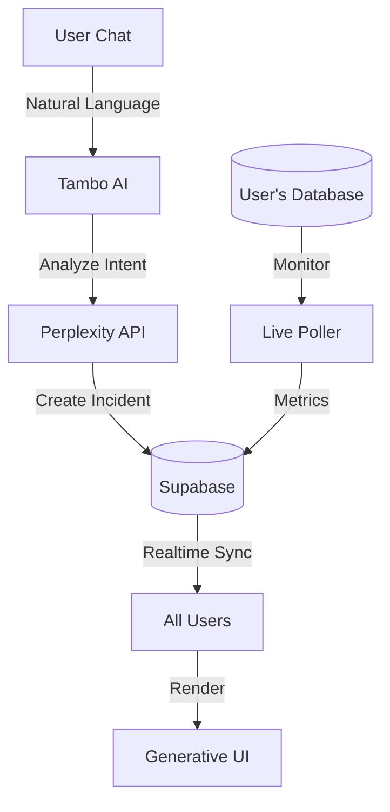

# 🚨 Data Guard: The AI Incident Commander

> **"When production is burning, don't search for dashboards. Data Guard builds them for you, in real-time."**

[](https://youtu.be/YOUR_ID)  
**Live Demo:** [dataguard.vercel.app](https://dataguard.vercel.app)

---

## 🏆 Tambo Hackathon 2026: "The UI Strikes Back"

**Data Guard** is the world's first incident management system with **Generative UI**. Instead of static dashboards, the interface adapts in real-time based on what's breaking.

**Built with:**

- 🤖 Tambo AI (natural language incident detection)
- ⚡ Supabase Realtime (multiplayer sync)
- 🎨 Generative UI (dynamic component rendering)

---

## 🎯 What Makes Data Guard Different?

| Traditional Tools           | Data Guard                            |
| --------------------------- | ------------------------------------- |
| Static dashboards           | **Generative UI** adapts per incident |
| English-only                | **Multi-language** (Hindi/Hinglish)   |
| 30-day setup (agents, SDKs) | **30-second** connection              |
| Manual triage               | **AI auto-detects** and categorizes   |
| One-size-fits-all           | **Dynamic widgets** per problem type  |

**TL;DR:** Not another monitoring tool. An AI-powered incident commander that adapts to YOU.

---

## 🌟 Key Features

### 1. ⚡ Zero-Config Database Monitoring

**No agents. No sidecars. Just credentials.**

```
1. Paste Supabase URL + API Key
2. AI scans your schema
3. Select tables to monitor
4. Start monitoring (< 30 seconds)
```


**What it monitors:**

- Failed transactions (e.g., `orders.status='failed'`)
- Error logs (e.g., `error_logs` table)
- Slow queries (response time > 2s)
- Data anomalies (sudden spikes/drops)

---

### 2. 🧠 AI-Powered Incident Detection

**Multi-language natural language processing:**

```
English: "Payment API is failing"
Hindi: "Payment service band ho gayi"
Hinglish: "Yaar checkout phat gayi hai"
```


**What happens:**

1. Tambo AI analyzes intent
2. Perplexity categorizes incident type
3. Creates incident in database
4. **Generates custom UI** based on problem

---

### 3. 🎨 Generative UI (The Magic!)

**Different problems = Different dashboards**

| Incident Type   | Generated Widgets                             |
| --------------- | --------------------------------------------- |
| Payment Failure | ErrorGraph + PaymentLogs + RollbackButton     |
| Slow Queries    | LatencyGraph + QueryAnalyzer + OptimizeButton |
| Traffic Spike   | TrafficGraph + AutoScaler + LoadBalancer      |


**Powered by `ui_config` JSONB:**

```json
{
  "widgets": [
    { "componentName": "ErrorGraph", "reason": "Spike detected" },
    { "componentName": "RollbackButton", "reason": "Recent deployment" }
  ],
  "suggestedActions": ["Rollback to v1.2.3", "Scale up instances"]
}
```

---

### 4. 🔄 Real-Time Collaboration

**Multiplayer incident response:**

- All team members see the same dashboard
- Actions sync across sessions
- Timeline updates live
- Supabase Realtime + Tambo = magic

---

### 5. 🤖 AI Post-Mortems

Auto-generated after incident resolution:

- Timeline reconstruction
- Root cause analysis
- Suggested preventions
- MTTR calculation

---

## 🏗️ Architecture



**Stack:**

- Frontend: Next.js 16, Framer Motion, Recharts
- Backend: Supabase (Postgres, Realtime, RPC)
- AI: Tambo + Perplexity API
- Real-time: Custom `useLiveMonitor` hook

---

## 🚀 Quick Start

### Prerequisites

- Node.js 18+
- [Supabase](https://supabase.com) project
- [Tambo](https://tambo.ai) API key
- [Perplexity](https://perplexity.ai) API key

### 1. Clone & Install

```bash
git clone https://github.com/tosif121/data-guard.git
cd data-guard
npm install
```

### 2. Setup Database

1. Go to Supabase SQL Editor
2. Run `supabase/migrations/schema.sql`
3. Enable Realtime for tables: `services`, `incidents`, `metrics`, `error_logs`

### 3. Configure Environment

```env
# .env.local
NEXT_PUBLIC_SUPABASE_URL=your_project_url
NEXT_PUBLIC_SUPABASE_ANON_KEY=your_anon_key
NEXT_PUBLIC_TAMBO_API_KEY=your_tambo_key
PERPLEXITY_API_KEY=your_perplexity_key
SLACK_WEBHOOK_URL=your_slack_webhook # Optional: For seamless alerts
```

---

## 🌟 Key Features (New!)

### 5. 💬 Real Slack Integration

Keep your team in the loop without leaving the dashboard.

- **Instant Alerts:** Post updates directly to `#incidents`, `#general`, or custom channels.
- **Smart Context:** Messages include current status, severity, and service name.
- **Zero-Config:** Just add your Webhook URL.

### 6. 🕹️ Global Polling Controls

Take control of your data flow.

- **Pause/Resume:** Freeze the dashboard state instantly (perfect for demos!).
- **Adjust Interval:** Poll every 2s, 5s, or 30s.
- **Universal Sync:** Controls affect Supabase fetches, Live API checks, and Realtime subscriptions simultaneously.

---

### 🟢 1. The "Red Alert" (Visual Spike)

**Context:** Payment API outage.

> "The Payment API is throwing 500 errors everywhere!"

**Result:** Status turns **CRITICAL** (Red). Shows `ErrorGraph` and "Rollback" button.

### 🟢 2. The "Desi Developer" (Hinglish Support)

**Context:** Multilingual AI understanding.

> "Yaar pura database phat gaya hai, queries atak rahi hain"

**Result:** AI detects "Database Latency". Shows `LatencyGraph` and "Kill Queries" button.

### 🟢 3. The "Chaos Mode" (Traffic Spike)

**Context:** Viral traffic load.

> "We are getting hit by a massive DDoS attack on the login page"

**Result:** Status turns **CRITICAL**. Shows `TrafficGraph` and "Block IP" button.

### 🔵 4. The "Zero-Config" Setup

**Context:** Connecting a new database.

> "Connect to database https://xyz.supabase.co API_KEY:eyJhbG..."

**Result:** System connects, fetches schema, and asks which tables to monitor.

### 🟣 5. The "Fix It" (Rollback)

**Context:** Resolving the incident.

> "Initiate emergency rollback to version v2.0.4"

**Result:** Timeline updates, status resolves, and error graph cleans up.

---

---

> **"From zero to monitoring in 30 seconds. From incident to resolution in 3 minutes."**
>
> Built with ❤️ by [@tosif121](https://github.com/tosif121) for Tambo Hackathon 2026
