# 🔥 Code Critic: The UI Strikes Back

> **"Pull requests are boring. Code reviews are tedious. What if your UI fought back against bad code with personality?"**

[](https://youtu.be/YOUR_ID)  
**Live Demo:** [code-critic.vercel.app](https://code-critic.vercel.app)

---

## 🏆 Tambo Hackathon 2026: "The UI Strikes Back"

**Code Critic** is a "Roast-as-a-Service" platform that uses **Generative UI** to brutally (or gently) critique your code.

Instead of a boring list of lint errors, the interface **literally explodes** with custom widgets based on what's wrong with your code.

**Built with:**

- 🤖 **Tambo AI** (The Critic)
- 🧠 **Perplexity API** (The Brain)
- 🎨 **Generative UI** (The Visuals)
- ⚡ **Supabase Realtime** (Multiplayer Roasting)

---

## 🎯 What It Does

1.  **Paste Code:** Any language (JS, Python, Rust, etc.)
2.  **Select Roast Level:**
    - 🥺 **Gentle:** Constructive feedback.
    - 😐 **Medium:** Witty sarcasm (Default).
    - 🔥 **Savage:** Emotional damage.
3.  **Generative UI Explodes:**
    - 💣 **Security Risk?** A glowing red "Security Bomb" appears.
    - 🍝 **Bad Logic?** The "Spaghetti Meter" goes off the charts.
    - 🐢 **Slow Code?** The "Performance Turtle" crawls across the screen.

---

## 🌟 Key Features (The "Strikes Back" Tech)

### 1. 💣 Generative Widgets

The UI isn't static. It _reacts_ to your code's specific problems.

| Issue Type          | Generated Widget    | Description                                          |
| :------------------ | :------------------ | :--------------------------------------------------- |
| **Critical Vuln**   | `SecurityBomb`      | An animated red bomb that pulses based on severity.  |
| **Complexity**      | `SpaghettiMeter`    | A specialized gauge that measures "Mama Mia" levels. |
| **O(n²) Loop**      | `PerformanceTurtle` | An animated turtle racing a blur (rabbit).           |
| **Everything Else** | `GenericRoast`      | A dynamic card with custom emojis and roast text.    |

### 2. 🧠 The Roast Engine

Powered by **Perplexity `sonar-pro`**, Code Critic doesn't just find bugs—it understands _context_.

> **Code:** `const password = "admin123";`
> **Roast:** "Congratulations! You've just built a security system that can be hacked by a golden retriever."

### 3. ⚡ Multiplayer Roasting

Built on **Supabase Realtime**.

- Share a link to your Roast Session.
- Watch your team react as the UI roasts your PR live.

---

## 🏗️ Architecture

```mermaid
graph TD
    User[User Input] -->|Code Snippet| NextJS[Next.js Backend]

    subgraph "The Roast Engine"
    NextJS -->|Analyze + Roast| Perplexity[Perplexity API]
    Perplexity -->|JSON Response| NextJS
    end

    NextJS -->|Save Result| Supabase[(Supabase DB)]

    subgraph "Generative UI"
    Supabase -->|Realtime Sync| Client[React Frontend]
    Client -->|Map Issue Type| Widgets[Custom Widgets]
    Widgets -->|Render| Bomb[Security Bomb 💣]
    Widgets -->|Render| Spaghetti[Spaghetti Meter 🍝]
    end
```



**Stack Refined:**

- **Frontend:** Next.js 16, Framer Motion, Lucide Icons.
- **Backend:** Next.js API Routes, Perplexity API.
- **Database:** Supabase (Postgres + Realtime).

---

## 🚀 Quick Start

### Prerequisites

- Node.js 18+
- Supabase Project
- Perplexity API Key

### 1. Clone & Install

```bash
git clone https://github.com/tosif121/code-critic.git
cd code-critic
npm install
```

### 2. Setup Database

Run `supabase/migrations/schema.sql` in your Supabase SQL Editor.

### 3. Configure Environment

```env
# .env.local
NEXT_PUBLIC_SUPABASE_URL=your_project_url
NEXT_PUBLIC_SUPABASE_ANON_KEY=your_anon_key
PERPLEXITY_API_KEY=your_perplexity_key
```

---

## 🟢 Demo Scenarios

### Scenario 1: The "Bob Builder" (Security Risk)

**Input:** `db.query("SELECT * FROM users WHERE id = " + id)`
**Result:**

- **Widget:** `SecurityBomb` (Critical)
- **Roast:** "This SQL injection vulnerability is so wide open, I could drive a truck through it alongside your entire database."

### Scenario 2: The "Yolo Loop" (Performance)

**Input:** Nested loops iterating over 100k items.
**Result:**

- **Widget:** `PerformanceTurtle` (Slow)
- **Roast:** "This code is slower than a dial-up connection in 1999. O(n^2)? more like O(no)."

### Scenario 3: The "Italian Chef" (Complexity)

**Input:** A 200-line function with 15 if-else statements.
**Result:**

- **Widget:** `SpaghettiMeter` (95%)
- **Roast:** "I've seen bowls of pasta with better structure than this logic."

---

> **"Code reviews shouldn't be boring. Let the UI strike back."**
>
> Built with ❤️ (and sass) by [@tosif121](https://github.com/tosif121) for Tambo Hackathon 2026
